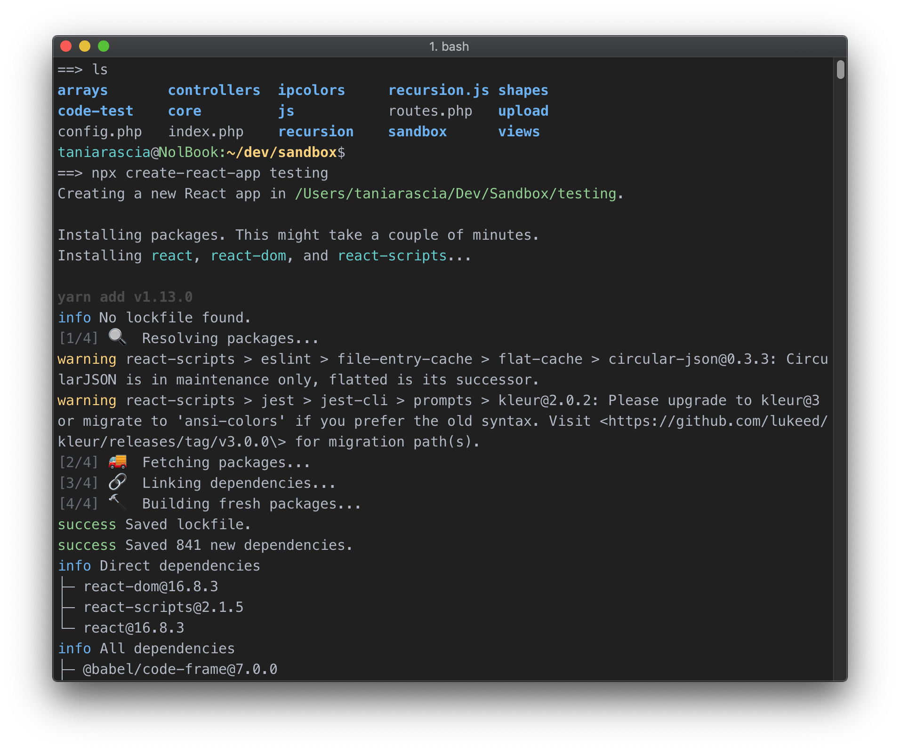
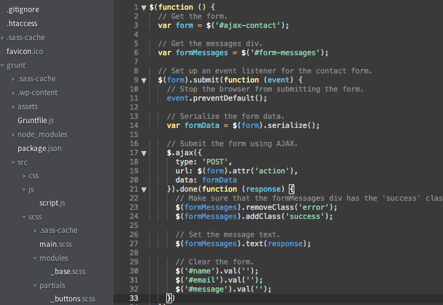
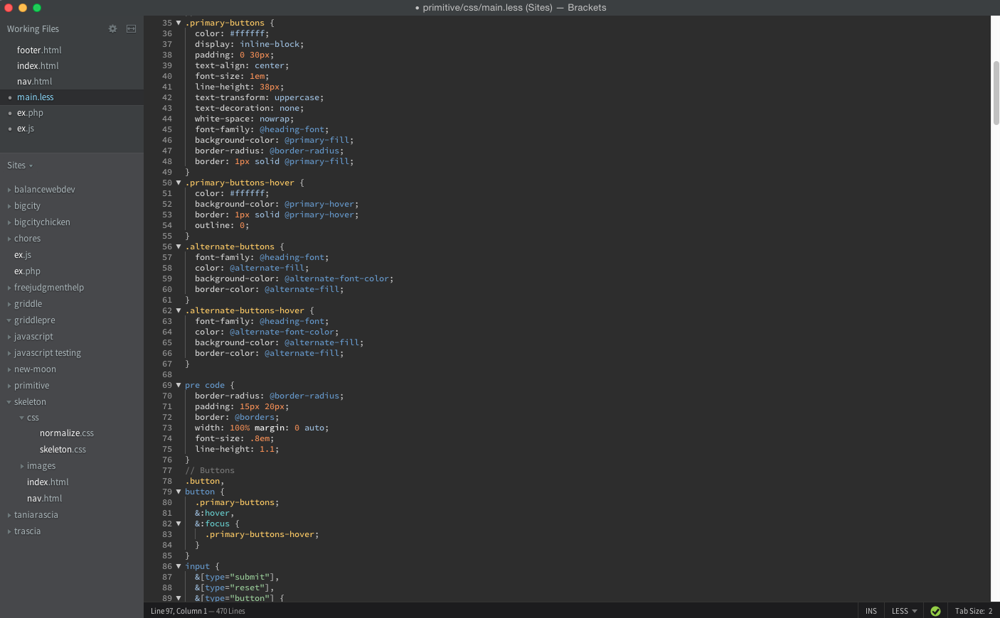
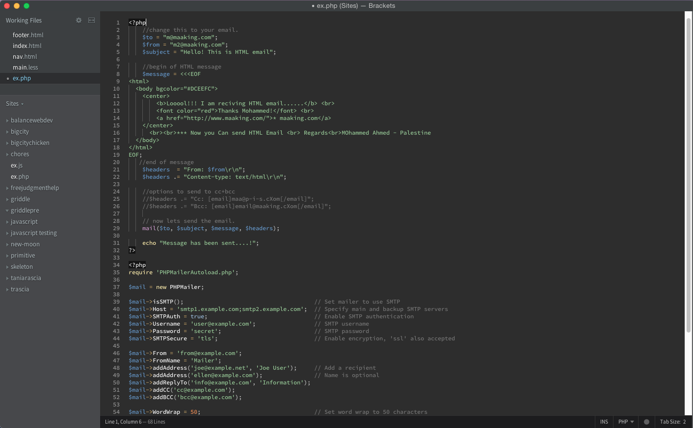

# New Moon Theme

   

[New Moon](https://taniarascia.github.io/new-moon/) is the optimized dark theme for web development. It's intuitive, easy on the eyes, and consistent across your entire development environment. It's pleasant for long coding hours in any language, and particularly well suited for HTML, CSS, SCSS/LESS, PHP (WordPress), and JavaScript (React, Vue).

- Intuitive connections between HTML and CSS
- Clear distinctions between code and markup
- Optimized for JSX/React, Vue, and PHP/WordPress

## Platforms

New Moon is available for:

- [Visual Studio Code](https://marketplace.visualstudio.com/items?itemName=taniarascia.new-moon-vscode)
- [Chrome DevTools](https://chrome.google.com/webstore/detail/devtools-theme-new-moon/lndddploiofhfpdcoclegenegblkhlfk?hl=en)
- [Brackets](https://github.com/taniarascia/new-moon-brackets)
- [Sublime Text](https://packagecontrol.io/packages/New%20Moon%20Color%20Scheme)
- [Atom](https://github.atom.io/packages/new-moon-atom-syntax)
- [iTerm2](https://github.com/taniarascia/new-moon/tree/master/iterm2)
- [Terminal.app](https://github.com/taniarascia/new-moon/tree/master/Terminal.app)
- [Hyper Term](https://github.com/Tmeister/hyperterm-new-moon-theme)
- [Blink Shell](https://github.com/taniarascia/new-moon/tree/master/blink-shell)
- [Vim](https://github.com/taniarascia/new-moon.vim)
- [Alfred](https://www.alfredapp.com/extras/theme/3iInBeai82/)
- [Slack](https://github.com/taniarascia/new-moon/tree/master/slack)

## What Are People Saying?

> “Absolutely beautiful theme. Definitely deserves more recognition.”
> — _Arcadia_

> “Undoubtedly the best color theme ever. Just install and see yourself. The background color is perfect for long time exposure to the eyes. And the code color is well lit and separated from each other.”
> — _Ibnul Alam_

> “Great theme for long coding hours.”
> — _Volkan_

> “Really surprised this theme isn't more popular. It's a joy to use for HTML/CSS/JS and PHP. I like that it isn't heavy on blue colors like a lot of the popular dark themes.”
> — _Brendan_

> “I've been using New Moon for several weeks now, I love it. The color palette is very easy on the eyes, especially after a few hours of coding.”
> — _Jose_

> “Wonderful. Well crafted with a clear sense of experience and focus. It actually helps me code more by enjoying the process more. Excellent work Tania.”
> — _Monte_

> “Sometimes I open my editor just to admire New Moon and be inspired. Truly a work of art."
> — _Sobie_

## Colors

| Usage           | Palette      | Hex Code                                                           |
| --------------- | ------------ | ------------------------------------------------------------------ |
| Background      | Darkest      |  `#2d2d2d` |
| Comment         | Medium       |  `#777c85` |
| Foreground      | Light        |  `#b3b9c5` |
| Function        | Lightest     |  `#ffffff` |
| Variable        | Red          |  `#f2777a` |
| Number          | Orange       |  `#fca369` |
| Attribute       | Yellow       |  `#ffd479` |
| Keyword         | Light Yellow |  `#ffeea6` |
| String          | Green        |  `#92d192` |
| Class/Tag       | Blue         |  `#6ab0f3` |
| Constant/Pseudo | Aqua         |  `#76d4d6` |
| Support         | Purple       |  `#e1a6f2` |
| Operator        | Beige        |  `#ac8d58` |

## Screenshots

### Chrome DevTools

### iTerm2

### VSC: JavaScript/React

### VSC: CSS/SCSS

### VSC: PHP

## Contributing

New Moon themes for any app are welcome! To contribute:

- Create a repo called `new-moon-app-name` based on [template-example](/template-example)
- Add the code for your theme and update the README with a screenshot and installation instructions
- Create an issue requesting to be added to the repository and link to your repo

A git subtree will be added pulling your repo into the main `new-moon` repo.

If your theme does not require you to maintain its own repository, simply create a pull request with the theme in a folder.

## Acknowledgements

- Originally inspired by Twilight and [Tomorrow Night Eighties](https://github.com/chriskempson/tomorrow-theme).
- Chrome DevTools theme forked from [Zero Base Themes](https://github.com/mauricecruz/zero-base-themes).

## Author

- [Tania Rascia](https://www.taniarascia.com/)

## License

This project is open source and available under the [MIT License](LICENSE).
