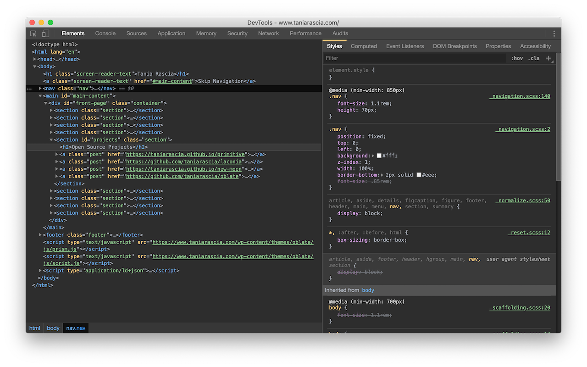

# New Moon for [Chrome DevTools](https://chrome.google.com/webstore/detail/devtools-theme-new-moon/lndddploiofhfpdcoclegenegblkhlfk?hl=en)

The optimized dark theme for web development.

## Installation

- Navigate to `chrome://flags`, find **Developer Tools Experiments** and toggle to **Enabled**.
- Reload Chrome.
- In DevTools, click the three dots menu, go to **Settings -> Experiments** and select **Allow UI Themes**.
- Set theme to **Dark Mode** (this is important, or the theme won't look right).
- Load a new tab and enjoy your awesome new DevTools theme!

## Author

- [Tania Rascia](https://www.taniarascia.com)

## License

This project is open source and available under the [MIT License](LICENSE).
