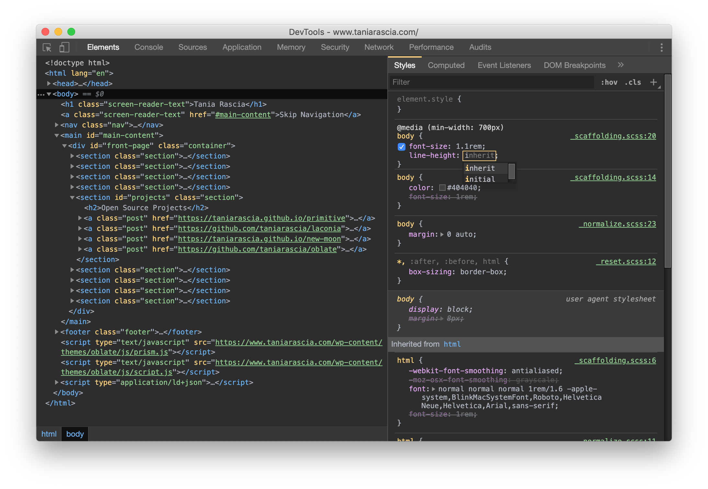
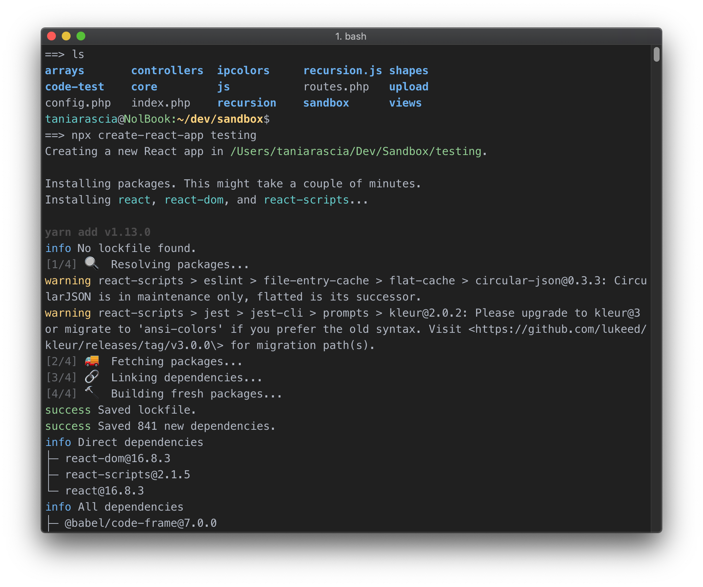
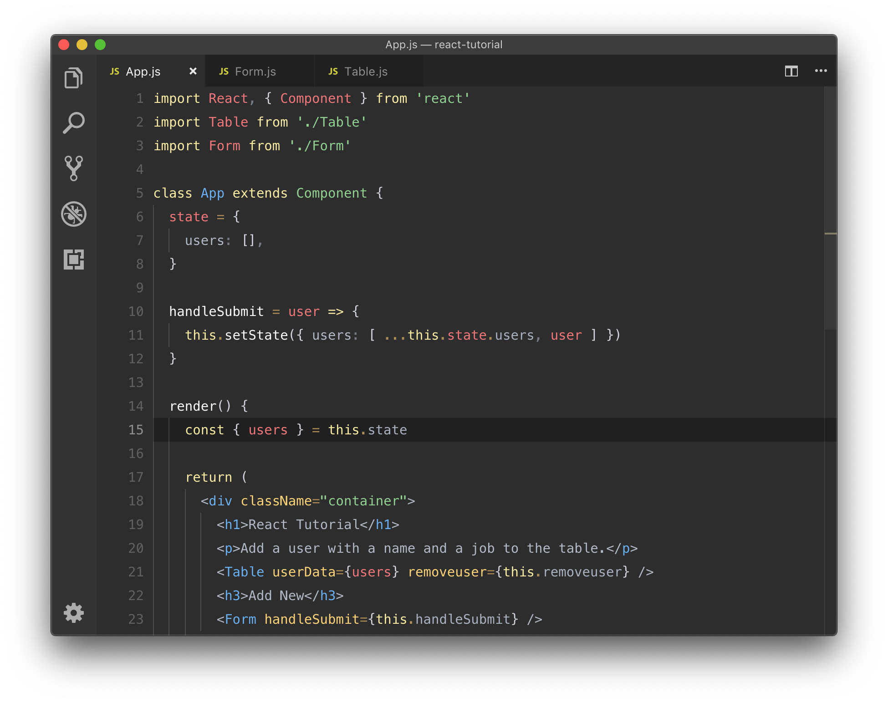
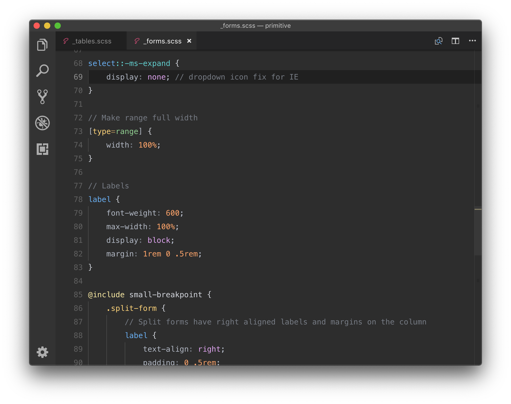
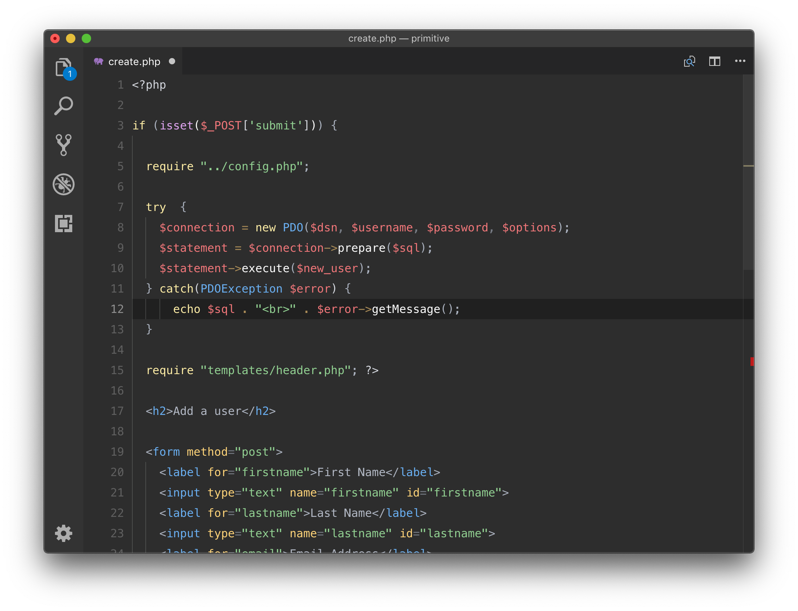

# New Moon Syntax Theme 

The optimized dark theme for web development.

- [View Website](https://taniarascia.github.io/new-moon)

## Intuitive Syntax Highlighting

[New Moon](https://taniarascia.github.io/new-moon) is the optimized dark theme for web development. I've meticulously designed New Moon to be easy on the eyes with intuitive connections between related elements. It's pleasant for long coding hours in any language, and particularly well suited for HTML, CSS, Sass, PHP, and JavaScript.

- HTML & CSS work together
- Optimized for JSX and React
- Clear distinctions between code and markup

## Platforms

New Moon is available for:

- [Visual Studio Code](https://marketplace.visualstudio.com/items?itemName=taniarascia.new-moon-vscode)
- [Chrome DevTools](https://github.com/taniarascia/new-moon-chrome-devtools)
- [iTerm2](https://github.com/taniarascia/new-moon/tree/master/iterm2)
- [Brackets](https://github.com/taniarascia/new-moon-brackets)
- [Sublime Text](https://packagecontrol.io/packages/New%20Moon%20Color%20Scheme)
- [Atom](https://github.atom.io/packages/new-moon-atom-syntax)

> **Note:** The Visual Studio Code, Chrome DevTools, and iTerm2 themes are actively maintained.

## What Are People Saying?

> “Absolutely beautiful theme. Definitely deserves more recognition.”
> — _Arcadia_

> “Undoubtedly the best color theme ever. Just install and see yourself. The background color is perfect for long time exposure to the eyes. And the code color is well lit and separated from each other.”
> — _Ibnul Alam_

> “Great theme for long coding hours.”
> — _Volkan_

> “Really surprised this theme isn't more popular. It's a joy to use for HTML/CSS/JS and PHP. I like that it isn't heavy on blue colors like a lot of the popular dark themes.”
> — _Brendan_

> “I've been using New Moon for several weeks now, I love it. The color palette is very easy on the eyes, especially after a few hours of coding.”
> — _Jose_

## Colors

| Usage           | Palette      | Hex Code                                                            |
| --------------- | ------------ | ------------------------------------------------------------------- |
| Background      | Darkest      |  `#2d2d2d`  |
| Comment         | Medium       |  `#777c85`  |
| Foreground      | Light        |  `#b3b9c5`  |
| Function        | Lightest     |  `#ffffff`  |
| Variable        | Red          |  `#f2777a`  |
| Number          | Orange       |  `#fca369`  |
| Attribute       | Yellow       |  `#ffd479`  |
| Keyword         | Light Yellow |  `#ffeea6`  |
| String          | Green        |  `#92d192`  |
| Class/Tag       | Blue         |  `#6AB0F3`  |
| Constant/Pseudo | Aqua         |  `#76d4d6`  |
| Support         | Purple       |  `#e1a6f2`  |
| Operator        | Beige        |  `#ac8d58`  |

## Screenshots

### Chrome DevTools

### iTerm2

### VSC: JavaScript/React

### VSC: CSS/Sass

### VSC: PHP

## Installation

New Moon can be installed through the package/extension/plugin manager by searching for "new-moon".

### Chrome DevTools

1. Navigate to chrome://flags, find Developer Tools Experiments and toggle to Enabled.
1. Reload Chrome.
1. In DevTools, click the three dots menu, go to Settings -> Experiments and select Allow UI Themes.
1. Set theme to "Dark Mode"
1. Load a new tab and enjoy your awesome new DevTools theme!

### iTerm2

1. iTerm2 > Preferences > Profiles > Colors
1. Load Presets
1. Select Import
1. Select `new-moon.itermcolors`
1. Select New Moon from color presets

## Acknowledgements

- Originally inspired by Twilight and [Tomorrow Night Eighties](https://github.com/chriskempson/tomorrow-theme).
- Chrome DevTools theme forked from [Zero Base Themes](https://github.com/mauricecruz/zero-base-themes)

## Author

- [Tania Rascia](https://www.taniarascia.com)

## License

This project is open source and available under the [MIT License](LICENSE).
