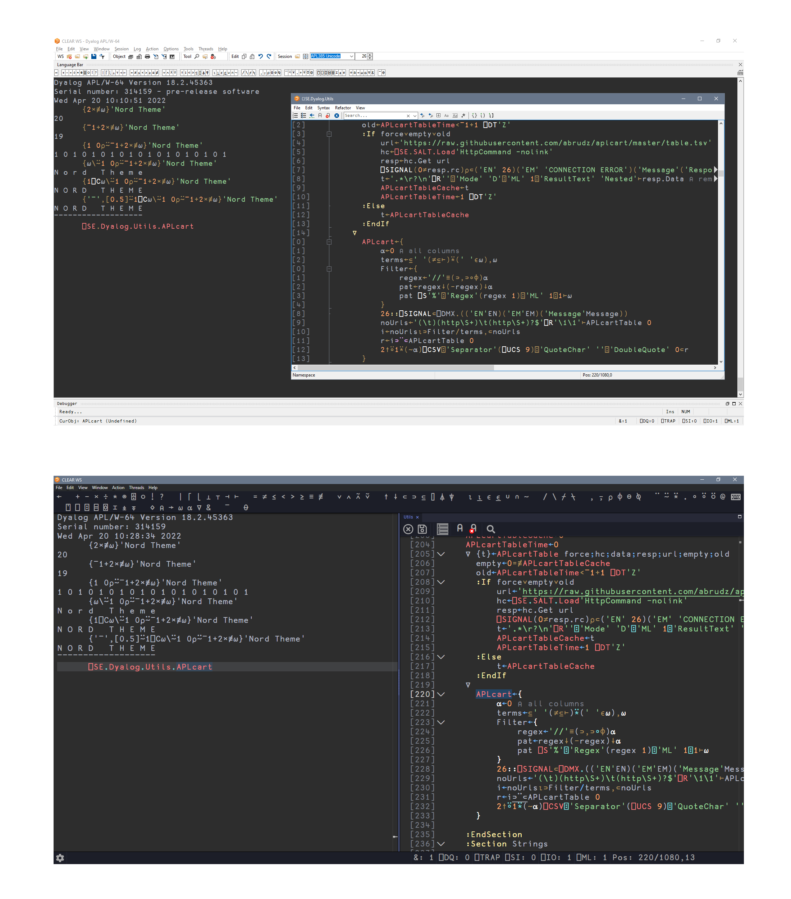

# New Moon for [Dyalog](https://www.dyalog.com)

The optimized dark theme for web development.

## Installation

- Nothing to install; comes bundled with both with Dyalog APL/W version 18.2 and with RIDE 4.4 or higher
- For Dyalog APL/W:
  - Go to `Options > Colours > Syntax`
  - Select `New Moon` from scheme
  - Go to `Session/Trace`
  - Select `New Moon` from session colour scheme
- For RIDE:
  - Go to `Edit > Preferences > Colour`
  - Select `New Moon` from scheme

## Author

- [Tania Rascia](https://www.taniarascia.com)

## License

This project is open source and available under the [MIT License](../LICENSE).
