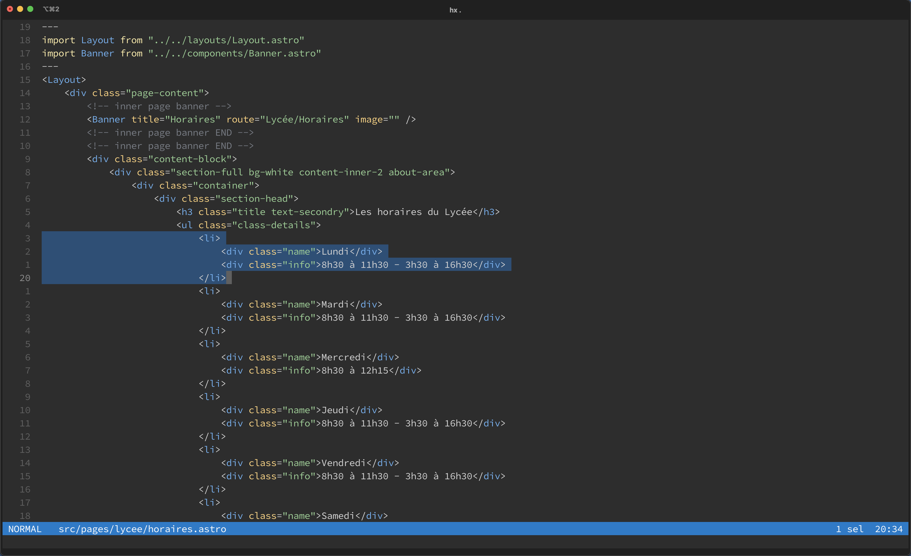

# New Moon for [Helix](https://helix-editor.com/)

The optimized dark theme for web development.




## Installation

- Download [new_moon.toml](new_moon.toml)
- Move the file to:
	- `~/.config/helix/themes` for Linux and Mac
	- `%AppData%\helix\themes` for Windows
- Change your theme from the config file (accessible by running the `:config-open` command inside Helix) by adding this at the top of the file: 
	```toml
	theme = "new_moon"
	```

## Porter

- [Imrane Chehabi](https://www.imrane.dev)

## Author of the original theme

- [Tania Rascia](https://www.taniarascia.com)